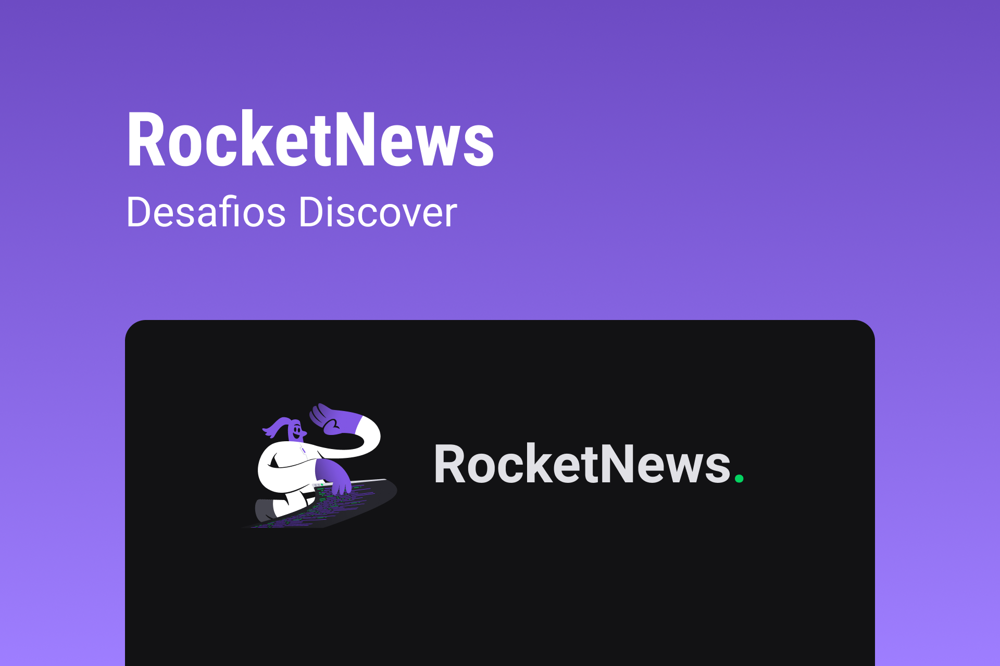

<h1 align="center">
  
</h1>

## RocketNews

O projeto é uma página para captação de leads ou newsletter.

**Requisitos para o desafio:**

- Criar uma página que contenha um formulário para que o usuário possa inserir o e-mail.
- Ter um botão para o usuário clicar após inserir o e-mail.

**_Se desafie também:_**

- _Criando uma função para o botão (ex. Exibir um alerta)_
- _Salvar os e-mails digitados em algum banco de dados_

## 🎨 Style Guide

### **Cores:**

```css
:root {
  --body-bg-color: #121214;
  --text-color: #e1e1e6;
  --title-color: #04d361;
  --form-color: #a8a8a8;
  --bg-button-color: #8257e5;
}
```

### **Tipo de fonte:**

font-family: Spartan, Work Sans

font-weight: 400, 500, 700

Você pode encontrar a fonte no [Google Fonts](https://fonts.google.com/)

Obs: A fonte Spartan não foi encontrada no Google Fonts, por isso foi substituída pela fonte `League Spartan`
